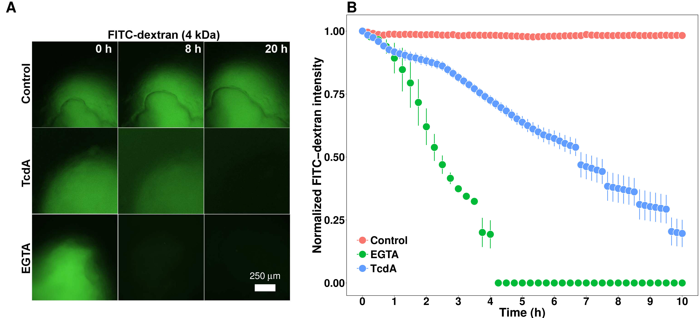

# Real-time measurement of epithelial barrier permeability in human intestinal organoids

David R. Hill<sup>1#</sup>, Sha Huang<sup>1</sup>, Yu-Hwai Tsai<sup>1</sup>, Jason R. Spence<sup>1,2</sup>, and Vincent B. Young<sup>1,3,4</sup>,

<sup>1</sup>Department of Internal Medicine, Division of Gastroenterology, University of Michigan, Ann Arbor MI 48109
<sup>2</sup>Department of Cell and Developmental Biology, University of Michigan, Ann Arbor MI 48109 
<sup>3</sup>Department of Internal Medicine, Division of Infectious Disease, University of Michigan, Ann Arbor MI 48109
<sup>4</sup>Department of Microbiology and Immunology, University of Michigan, Ann Arbor MI 48109

<sup>#</sup>author for correspondence:
David R. Hill (hilldr@med.umich.edu)

## Summary 

This protocol describes the measurement of epithelial barrier permeability in real-time following pharmacologic treatment in human intestinal organoids using fluorescent microscopy and live cell microscopy

## Abstract

Advances in 3D culture of intestinal tissues obtained through biopsy or generated from pluripotent stem cells via directed differentiation have resulted in sophisticated *in vitro* models of the intestinal mucosa. Leveraging these emerging model systems will require adaptation of tools and techniques developed for 2D culture systems and animals. Here, we describe a technique for measuring epithelial barrier permeability in human intestinal organoids in real-time. This is accomplished by microinjection of fluorescently-labeled dextran and imaging on an inverted microscope fitted with epifluorescent filters. Real-time measurement of the barrier permeability in intestinal organoids facilitates the generation of high-resolution temporal data in human intestinal epithelial tissue, although this technique is can also be applied to fixed timepoint imaging approaches. This protocol is readily adaptable for the measurement of epithelial barrier permeability following exposure to phamacologic agents, bacterial products or toxins, or live microorganisms.  With minor modifications, this protocol can also serve as a general primer on microinjection of intestinal organoids and users may choose to supplement this protocol with additional or alternative downstream applications following microinjection.

## Representative data



__A__ Stem-cell derived human intestinal organoids (HIO) microinjected with 2 mg/ml FITC-dextran (4 kDa) imaged for 20 hours. HIOs were also microinjected with PBS (control) or the *Clostridium difficile* toxin TcdA (12.8 ng/&mu;l) or treated with 2 mM EGTA added to the external culture media. 4X Magnification. __B__ Plot of mean normalized FITC intensity over time in HIOs treated with PBS (control), TcdA, or EGTA. Error bars represent S.E.M and N = 4-6 HIOs per group.

## How to use this protocol

This protocol is on GitHub for a reason. We invite you to ask questions, make suggestions, and engage with the science presented here. Use the GitHub "Issues" feature to post questions and comments that you want to make available for public discussion. Contact the authors if you would like to be added as a contributor to this repository. Submit a pull request. Or fork this repository and make your own changes

We suspect that the majority of users will want to simply download the PDF version of the manuscript. Go for it!

If you are interested in understanding the inner workings of the code for conducting the analysis and generating the paper (have you heard of this thing called "Reproducible Research"?), you may want to try cloning this repository to your computer and compiling the paper.

To compile the paper from source, you will need the following tools:
* working [TeX Live](https://www.tug.org/texlive/) installation
* [R](https://cran.r-project.org/) version > 3.4
* [ImageJ](https://imagej.nih.gov/ij/)

Then navigate to your local clone of this repository and type the following in the command prompt:

```sh
make pdf
```

## Citing this protocol

Hill, D. R., Huang, S., Tsai, Y. H., Spence, J. R., Young, V. B. Real-time Measurement of Epithelial Barrier Permeability in Human Intestinal Organoids. J. Vis. Exp. (), e56960, doi:10.3791/56960 (2017).

https://www.jove.com/video/56960/real-time-measurement-epithelial-barrier-permeability-human
